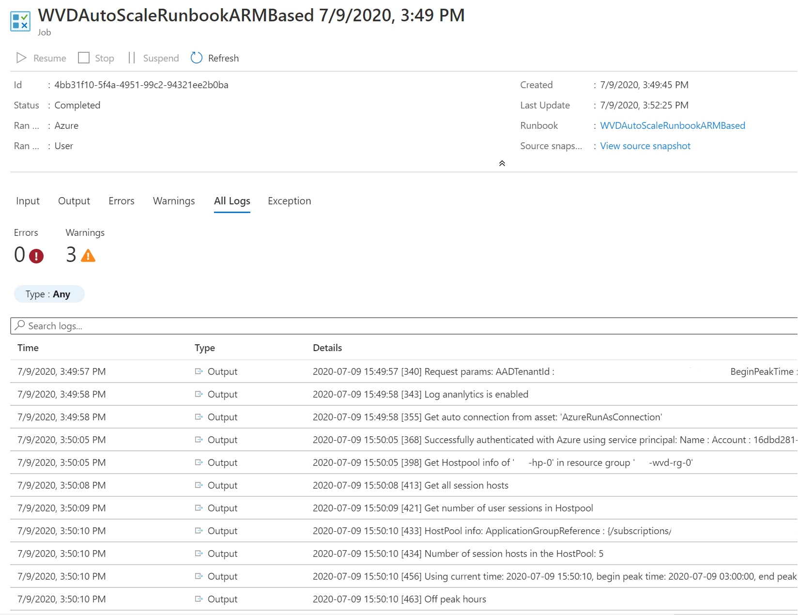

# Scale session hosts using Azure Automation

You can reduce your total Windows Virtual Desktop deployment cost by scaling your virtual machines (VMs). This means shutting down and deallocating session host VMs during off-peak usage hours, then turning them back on and reallocating them during peak hours.

In this article, you'll learn about the scaling tool built with Azure Automation and Azure Logic Apps that will automatically scale session host virtual machines in your Windows Virtual Desktop environment. To learn how to use the scaling tool, skip ahead to [Prerequisites](#prerequisites).

## Report issues

Issue reporting for internal preview of the scaling tool are currently being handled on [this Teams channel](https://teams.microsoft.com/l/channel/19%3ac01e8be08e864fc3808b3472355962bf%40thread.skype/WVD%2520Scaling%2520tool?groupId=e3e92040-a7e6-4096-a5d1-831aeba54943&tenantId=72f988bf-86f1-41af-91ab-2d7cd011db47)

Please report any documentation, errors, warnings and anamolies in above Teams link.

## How the scaling tool works

The scaling tool provides a low-cost automation option for customers who want to optimize their session host VM costs.

You can use the scaling tool to:
 
- Schedule VMs to start and stop based on Peak and Off-Peak business hours.
- Scale out VMs based on number of sessions per CPU core.
- Scale in VMs during Off-Peak hours, leaving the minimum number of session host VMs running.

The scaling tool uses a combination of Azure Automation PowerShell runbooks, webhooks, and Azure Logic Apps to function. When the tool runs, Azure Logic Apps calls a webhook to start the Azure Automation runbook. The runbook then creates a job.

During peak usage time, the job checks the current number of sessions and the VM capacity of the current running session host for each host pool. It uses this information to calculate if the running session host VMs can support existing sessions based on the *SessionThresholdPerCPU* parameter defined for the **CreateOrUpdateAzLogicApp.ps1** file. If the session host VMs can't support existing sessions, the job starts additional session host VMs in the host pool.

>[!NOTE]
>*SessionThresholdPerCPU* doesn't restrict the number of sessions on the VM. This parameter only determines when new VMs need to be started to load-balance the connections. To restrict the number of sessions, you need to follow the instructions [Update-AzWvdHostPool](/powershell/module/Az.DesktopVirtualization/Update-AzWvdHostPool/) to configure the *MaxSessionLimit* parameter accordingly.

During the off-peak usage time, the job determines how many session host VMs should be shut down based on the *MinimumNumberOfRDSH* parameter. If you set the *LimitSecondsToForceLogOffUser* parameter to a non-zero positive value, the job will notify any currently signed in users to save their work, wait the configured amount of time, and then force the users to sign out. Once all user sessions on the session host VM have been signed out, the job will shut down the VM. The job will set the session host VMs to drain mode to prevent new sessions from connecting to the hosts before the shutdown and reset it back after the shutdown.

If you set the *LimitSecondsToForceLogOffUser* parameter to zero, the job will allow the session configuration setting in specified group policies to handle signing off user sessions. To see these group policies, go to **Computer Configuration** > **Policies** > **Administrative Templates** > **Windows Components** > **Terminal Services** > **Terminal Server** > **Session Time Limits**. If there are any active sessions on a session host VM, the job will leave the session host VM running. If there are no active sessions i.e only after all sessions are logged off, the job will shut down the session host VM.

The job runs periodically based on a set recurrence interval. You can change this interval based on the size of your Windows Virtual Desktop environment, but remember that starting and shutting down virtual machines can take some time, so remember to account for the delay. We recommend setting the recurrence interval to every 15 minutes.

However, the tool also has the following limitations:

- This solution applies only to pooled multi-session session host VMs.
- This solution manages VMs in any region, but can only be used in the same subscription as your Azure Automation account and Azure Logic Apps.
- Max runtime of a job in the runbook is 3 hours. In case starting/stopping of VMs in a host pool takes longer than that, the job would fail. [More details](../automation/automation-runbook-execution#fair-share)

>[!NOTE]
>The scaling tool controls the load balancing mode of the host pool it is scaling. It sets it to breadth-first load balancing for both peak and off-peak hours.

## Prerequisites

Before you start setting up the scaling tool, make sure you have the following things ready:

- A [Windows Virtual Desktop host pool](create-host-pools-azure-marketplace.md)
- Session host pool VMs configured and registered with the Windows Virtual Desktop service
- A user with [Contributor access](../role-based-access-control/role-assignments-portal.md) on Azure subscription

The machine you use to deploy the tool must have: 

- Windows PowerShell 5.1 or later
- The Microsoft Az PowerShell module

If you have everything ready, then let's get started.

## Create an Azure Automation account

First, you'll need an Azure Automation account to run the PowerShell runbook. Below procedure is valid even if you have an existing Azure Automation account which you would like to use to setup the powershell runbook. Here's how to set up your account:

1. Open Windows PowerShell.

2. Run the following cmdlet to sign in to your Azure Account.

     ```powershell
     Login-AzAccount
     ```

     >[!NOTE]
     >Your account must have contributor rights on the Azure subscription that you want to deploy the scaling tool on.

3. Run the following cmdlet to download the script for creating the Azure Automation account:

     ```powershell
     Set-Location -Path "C:\Temp"
     $Uri = "https://raw.githubusercontent.com/Azure/RDS-Templates/wvd_scaling/wvd-templates/wvd-scaling-script/CreateOrUpdateAzAutoAccount.ps1"
     Invoke-WebRequest -Uri $Uri -OutFile ".\CreateOrUpdateAzAutoAccount.ps1"
     ```

4. Run the following cmdlet to execute the script and create the Azure Automation account:

     ```powershell
     $Params = @{
          "AADTenantId"           = "<Azure_Active_Directory_tenant_ID>"   # Optional. If not specified, it will use the current Azure context
          "SubscriptionId"        = "<Azure_subscription_ID>"              # Optional. If not specified, it will use the current Azure context
          "UseARMAPI"             = $true
          "ResourceGroupName"     = "<Resource_group_name>"                # Optional. Default: "WVDAutoScaleResourceGroup"
          "AutomationAccountName" = "<Automation_account_name>"            # Optional. Default: "WVDAutoScaleAutomationAccount"
          "Location"              = "<Azure_region_for_deployment>"        # Optional. Default: "West US2"
          "WorkspaceName"         = "<Log_analytics_workspace_name>"       # Optional. If not specified, log analytics workspace will not be used
          "ArtifactsURI"          = "https://raw.githubusercontent.com/Azure/RDS-Templates/wvd_scaling/wvd-templates/wvd-scaling-script"
     }

     .\CreateOrUpdateAzAutoAccount.ps1 @Params
     ```

5. The cmdlet's output will include a webhook URI. Make sure to keep a record of the URI because you'll use it as a parameter when you set up the execution schedule for the Azure Logic apps.

6. After you've set up your Azure Automation account, sign in to your Azure subscription and check to make sure your Azure Automation account and the relevant runbook have appeared in your specified resource group, as shown in the following image:

//todo need to update the image as the runbook for ARM based scaling tool is different "WVDAutoScaleRunbookARMBased"


  To check if your webhook is where it should be, select the name of your runbook. Next, go to your runbook's Resources section and select **Webhooks**.

## Create an Azure Automation Run As account

Now that you have an Azure Automation account, you'll also need to create an Azure Automation Run As account if you don't have one for the tool to access your Azure resources.

An [Azure Automation Run As account](../automation/manage-runas-account.md) provides authentication for managing resources in Azure with the Azure cmdlets. When you create a Run As account, it creates a new service principal user in Azure Active Directory and assigns the Contributor role to the service principal user at the subscription level, the Azure Run As Account is a great way to authenticate securely with certificates and a service principal name without needing to store a username and password in a credential object. To learn more about Run As authentication, see [Limit Run As account permissions](../automation/manage-runas-account.md#limit-run-as-account-permissions).

Any user who's a member of the Subscription Admins role and coadministrator of the subscription can create a Run As account by following the next section's instructions.

To create a Run As account in your Azure account:

1. In the Azure portal, select **All services**. In the list of resources, enter and select **Automation Accounts**.

2. On the **Automation Accounts** page, select the name of your Automation account.

3. In the pane on the left side of the window, select **Run As Accounts** under the Account Settings section.

4. Select **Azure Run As Account**. When the **Add Azure Run As Account** pane appears, review the overview information, and then select **Create** to start the account creation process.

5. Wait a few minutes for Azure to create the Run As account. You can track the creation progress in the menu under Notifications.

6. When the process finishes, it will create an asset named AzureRunAsConnection in the specified Automation account.

## Create the Azure Logic App and execution schedule

Finally, you'll need to create the Azure Logic App and set up an execution schedule for your new scaling tool. First, download and import the [Desktop Virtualization PowerShell module](powershell-module.md) to use in your PowerShell session if you haven't already.

1.  Open Windows PowerShell.

2.  Run the following cmdlet to sign in to your Azure Account.

     ```powershell
     Login-AzAccount
     ```

3. Run the following cmdlet to download the createazurelogicapp.ps1 script file on your local machine.

     ```powershell
     Set-Location -Path "C:\Temp"
     $Uri = "https://raw.githubusercontent.com/Azure/RDS-Templates/wvd_scaling/wvd-templates/wvd-scaling-script/CreateOrUpdateAzLogicApp.ps1"
     Invoke-WebRequest -Uri $Uri -OutFile ".\CreateOrUpdateAzLogicApp.ps1"
     ```

4. Run the following PowerShell script to create the Azure Logic app and execution schedule for your host pool (Note: You will need to run this for each of the host pool you want to auto scale).

     ```powershell
     $aadTenantId = (Get-AzContext).Tenant.Id
     
     $azureSubscription = Get-AzSubscription | Out-GridView -PassThru -Title "Select your Azure Subscription"
     Select-AzSubscription -Subscription $azureSubscription.Id
     $subscriptionId = $azureSubscription.Id
     
     $resourceGroup = Get-AzResourceGroup | Out-GridView -PassThru -Title "Select the resource group for the new Azure Logic App"
     $resourceGroupName = $resourceGroup.ResourceGroupName
     $location = $resourceGroup.Location
     
     $wvdHostpool = Get-AzWvdHostPool | Out-GridView -PassThru -Title "Select the host pool you'd like to scale"
     $hostPoolName = $wvdHostpool.Name
     $hostPoolResourceGroupName = (Get-AzResource -ResourceId $wvdHostpool.Id).ResourceGroupName
     
     $recurrenceInterval = Read-Host -Prompt "Enter how often you'd like the job to run in minutes, e.g. '15'"
     $beginPeakTime = Read-Host -Prompt "Enter the start time for peak hours in local time, e.g. 9:00"
     $endPeakTime = Read-Host -Prompt "Enter the end time for peak hours in local time, e.g. 18:00"
     $timeDifference = Read-Host -Prompt "Enter the time difference between local time and UTC in hours, e.g. +5:30"
     $sessionThresholdPerCPU = Read-Host -Prompt "Enter the maximum number of sessions per CPU that will be used as a threshold to determine when new session host VMs need to be started during peak hours"
     $minimumNumberOfRdsh = Read-Host -Prompt "Enter the minimum number of session host VMs to keep running during off-peak hours"
     $limitSecondsToForceLogOffUser = Read-Host -Prompt "Enter the number of seconds to wait before automatically signing out users. If set to 0, any session host VM that has user sessions, will be left untouched"
     $logOffMessageTitle = Read-Host -Prompt "Enter the title of the message sent to the user before they are forced to sign out"
     $logOffMessageBody = Read-Host -Prompt "Enter the body of the message sent to the user before they are forced to sign out"
     
     $automationAccount = Get-AzAutomationAccount -ResourceGroupName $resourceGroup.ResourceGroupName | Out-GridView -PassThru -Title "Select the Azure Automation account"
     $automationAccountName = $automationAccount.AutomationAccountName
     $automationAccountConnection = Get-AzAutomationConnection -ResourceGroupName $resourceGroup.ResourceGroupName -AutomationAccountName $automationAccount.AutomationAccountName | Out-GridView -PassThru -Title "Select the Azure RunAs connection asset"
     $connectionAssetName = $automationAccountConnection.Name
     
     $WebhookURI = Read-Host -Prompt "Enter the URI of the WebHook returned by when you created the Azure Automation Account"
     $maintenanceTagName = Read-Host -Prompt "Enter the name of the Tag associated with VMs you don't want to be managed by this scaling tool"

     $Params = @{
          "AADTenantId"                   = $aadTenantId                             # Optional. If not specified, it will use the current Azure context
          "SubscriptionID"                = $subscriptionId                          # Optional. If not specified, it will use the current Azure context
          "UseARMAPI"                     = $true
          "ResourceGroupName"             = $resourceGroupName                       # Optional. Default: "WVDAutoScaleResourceGroup"
          "Location"                      = $location                                # Optional. Default: "West US2"
          "HostPoolName"                  = $hostPoolName
          "HostPoolResourceGroupName"     = $hostPoolResourceGroupName               # Optional. Default: same as ResourceGroupName param value
          "LogAnalyticsWorkspaceId"       = "<Log_analytics_workspace_ID>"           # Optional. If not specified, script will not log to the log analytics workspace
          "LogAnalyticsPrimaryKey"        = "<Log_analytics_primary_key>"            # Optional. If not specified, script will not log to the log analytics workspace
          "ConnectionAssetName"           = $connectionAssetName                     # Optional. Default: "AzureRunAsConnection"
          "RecurrenceInterval"            = $recurrenceInterval                      # Optional. Default: 15
          "BeginPeakTime"                 = $beginPeakTime                           # Optional. Default: "09:00"
          "EndPeakTime"                   = $endPeakTime                             # Optional. Default: "17:00"
          "TimeDifference"                = $timeDifference                          # Optional. Default: "-7:00"
          "SessionThresholdPerCPU"        = $sessionThresholdPerCPU                  # Optional. Default: 1
          "MinimumNumberOfRDSH"           = $minimumNumberOfRdsh                     # Optional. Default: 1
          "MaintenanceTagName"            = $maintenanceTagName                      # Optional.
          "LimitSecondsToForceLogOffUser" = $limitSecondsToForceLogOffUser           # Optional. Default: 1
          "LogOffMessageTitle"            = $logOffMessageTitle                      # Optional. Default: "Machine is about to shutdown."
          "LogOffMessageBody"             = $logOffMessageBody                       # Optional. Default: "Your session will be logged off. Please save and close everything."
          "WebhookURI"                    = $WebhookURI
          "ArtifactsURI"                  = "https://raw.githubusercontent.com/Azure/RDS-Templates/wvd_scaling/wvd-templates/wvd-scaling-script"
     }

     .\CreateOrUpdateAzLogicApp.ps1 @Params
     ```

     After you run the script, the Logic App should appear in a resource group, as shown in the following image.

     

To make changes to the execution schedule, such as changing the recurrence interval or time zone, go to the Autoscale scheduler and select **Edit** to go to the Logic Apps Designer.

//todo need to update the image as the new logic app schedule uses HTTP action


## Manage your scaling tool

Now that you've created your scaling tool, you can access its output. This section describes a few features you might find helpful.

### View job status

You can view a summarized status of all runbook jobs or view a more in-depth status of a specific runbook job in the Azure portal.

On the right of your selected Automation account, under "Job Statistics," you can view a list of summaries of all runbook jobs. Opening the **Jobs** page on the left side of the window shows current job statuses, start times, and completion times.

//todo need to update the image as the runbook for ARM based scaling tool is different "WVDAutoScaleRunbookARMBased"


### View logs and scaling tool output

You can view the logs of scale-out and scale-in operations by opening your runbook and selecting the name of your job.

Navigate to the runbook (the default name is WVDAutoScaleRunbook) in your resource group hosting the Azure Automation account and select **Overview**. On the overview page, select a job under Recent Jobs to view its scaling tool output, as shown in the following image.

//todo need to update the image as the runbook for ARM based scaling tool is different "WVDAutoScaleRunbookARMBased" and output now looks different


